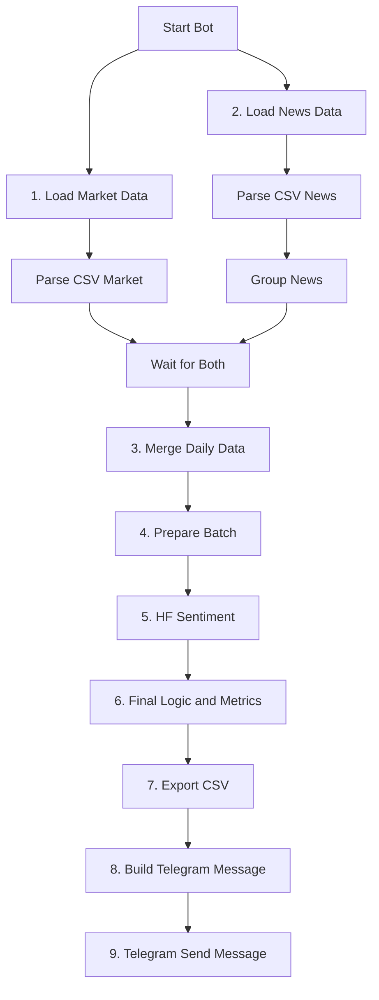

# Team 13 - Crypto Trading Strategy (n8n)

## 👥 Members
- Dmitrii Orel - 45

## 🧠 Strategy Overview

### Core Logic
This project implements a **hybrid scoring strategy** in `n8n`:

- market features (price, RSI, Bollinger bands),
- news aggregation by day,
- Hugging Face sentiment extraction,
- rule-based decision engine for `Strategy A` (baseline) and `Strategy B` (LLM + TA),
- export of `trade_log.csv` and `metrics.csv`.

**Key principles:**
- **Data fusion:** market CSV + news CSV are merged by date.
- **LLM-enhanced signal:** sentiment score and fear/greed proxy are combined with RSI and Bollinger levels.
- **Two-strategy comparison:** baseline vs enhanced strategy is tracked daily.
- **Automated reporting:** metrics + trade log are generated in workflow and can be sent to Telegram.

### Decision Flowchart (Mermaid)


### Performance Analysis
Current run snapshot (`metrics.csv`):

- **Sharpe Ratio:** **8.88**
- **Total Return:** **4.84%**
- **Max Drawdown:** **-1.39%**

**Strengths:**
- End-to-end reproducible `n8n` pipeline.
- Clean separation of data ingestion, LLM inference, and execution logic.
- Fast artifact generation (`trade_log.csv`, `metrics.csv`, workflow-level Telegram alert).

**Limitations & Learnings:**
- Quality depends on external CSV quality and consistency.
- HF sentiment response format may vary between models.
- Current dataset is short; robust validation needs longer history.

## 📁 Repository Contents

- **README.md** ← Strategy documentation
- **workflow.json** ← main n8n workflow (reference-style root file)
- **trade_log.csv** ← run log exported for reporting
- **metrics.csv** ← performance summary exported for reporting
- **workflows/slide_style_n8n_workflow.json** ← editable workflow source
- **src/** ← Python fallback pipeline for local testing
- **data/** ← sample market/news datasets
- **docker-compose.yml** ← n8n local deployment

## 🚀 Run n8n

```powershell
cd C:\projects\Work\work_project_1\ai_business_n8n_trading
Copy-Item .env.example .env
# set HF_API_TOKEN, TELEGRAM_BOT_TOKEN, TELEGRAM_CHAT_ID

docker compose up -d
```

Open `http://localhost:5678`, import `workflow.json`, run `Start Bot`.
